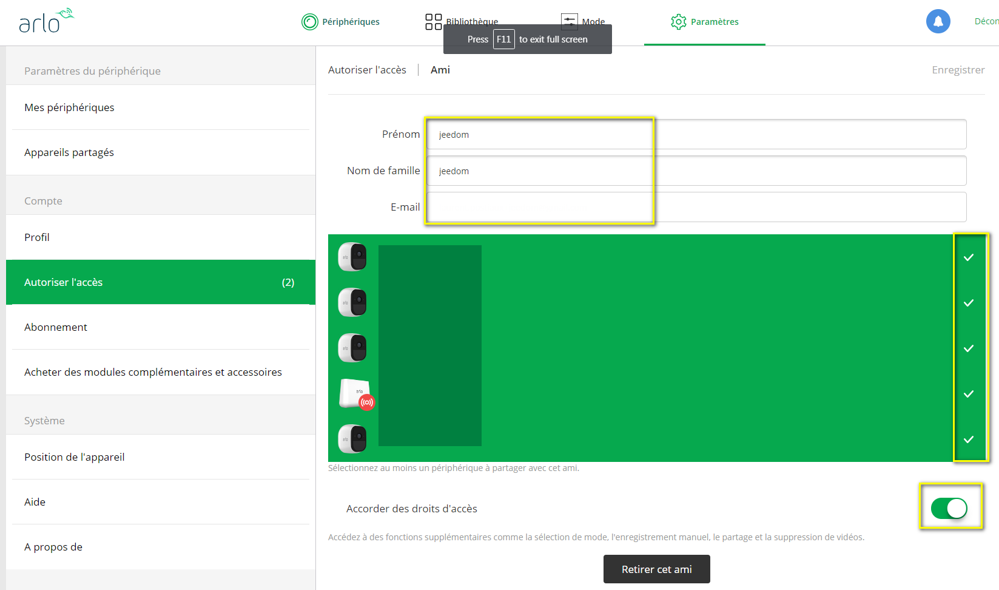

# Description

Plugin to control all Arlo devices like the cameras, the base station and the integrated siren.

All current models supported by the Arlo application (web or mobile) will be supported by the plugin: Arlo, Arlo Pro, Pro2, Pro3, Ultra, Arlo Q, Arlo Go, Arlo Baby ... but all the functions specific to each model are not yet integrated into the plugin (they will be in priority according to requests).

So far, it is possible to:

- select mode: Activated, Deactivated but also all custom modes;
- Enable / disable each camera independently of each other (regardless of the current mode);
- trigger the siren integrated to the base station and know its status;
- get the status of each camera:
  - connected or not
  - general status (inactive, alert, ...)
  - battery level (and if charging is in progress)
  - signal strength
  - if sound or motion detection is active
  - if sound or motion is detected
  - take a snapshot (stored locally)
  - record video (stored locally)
  - view snapshots and videos
  - start/stop recording (stored in Arlo cloud)
  - view live streaming of your cameras (with a few seconds of lag)

# Configuration

## Installation

> **Important**
>
> Le plugin n'a pas été testé sous Jessie et son fonctionnement sur cette version ne sera pas assuré.

In order to use the plugin, you must download, install and activate it like any Jeedom plugin.
Then you have to install the dependencies.
Before being able to launch the daemon it is necessary to input an email address and a password to be able to connect to Arlo.

## Creating a user dedicated to the plugin

Arlo does not allow simultaneous connections from one user to multiple interfaces: if you are logged into the app on one mobile, you will not be able to be on another mobile at the same time or on the web interface. If you connect to the web interface for example you will be automatically disconnected from the mobile app.
The plugin connects to the Arlo system as a standard user and will therefore be subject to the same constraint.

It is therefore necessary to create a user dedicated to the plugin, otherwise it will not work properly.

- For this, open <https://my.arlo.com> or open the mobile app;
- Click on &quot;Settings&quot; at the top right;

- Click on &quot;Allow access&quot; in the left menu and then on &quot;Add&quot; on the right.

- Enter the requested information including a new email address (or, if you use a gmail address, a gmail alias by adding + jeedom before @gmail.com for example);
- Select the Arlo devices that the plugin will access;
- Enable the option &quot;Grant access rights&quot; to be able to change modes, start recording, take snapshots etc from Jeedom.

- Click on &quot;Send an invitation&quot;
- You will receive a confirmation email to create your new Arlo account, simply follow the procedure.

> **Tip**
>
> Log out of &quot;My Arlo&quot;, open a &quot;private window&quot; on your browser or use another browser to create your second Arlo account.

## Plugin configuration

- Go back to the plugin configuration page and enter your user (the new email address) and the associated password.
- Start the daemon (if it does not start on its own)

If the email address and password are correct, the status should turn green and the plugin will start to synchronize your previously shared devices.

On this page, it is also possible to configure the retentions rules of snapshots and records, these rules allow the plugin to automatically delete the oldest medias (saved locally).

# Usage

If the plugin is correctly configured (see previous step), you should see the list of Arlo devices that you shared when creating the plugin account.

It is not possible to manually create a device. The devices are automatically created or updated by the plugin during synchronization with the Arlo system. Synchronization will be done automatically at least once a day, if necessary it is possible to start a synchronization manually via the device management screen.

The plugin will never automatically delete a device; if you no longer have the device or if you have removed the access rights for the plugin, it is recommended to manually delete the corresponding device in Jeedom.
If you add a new device or change the modes via the Arlo application, it is recommended to do a manual synchronization to update the plugin configuration immediately; otherwise, this will be done during the next automatic synchronization.

> **Tip**
>
> This obviously does not affect the values of the commands such as the selected mode or motion or sound detection which are updated in real time.

For most of the devices there is no specific configuration, the name of the device will be the one defined in Arlo paltform, but remember to assign the parent object, the category and activate it.

For camera devices, it is possible to configure an action command of the Mail or Telegram plugin. If this one is configured, the plugin will send a message, including the snapshot, as soon as a new one is available.

# Compatible devices

It is possible that some specific commands to certain models are not (yet) available, in this case please contact me via the forum for more information.

## The base station for Arlo pro, pro2, pro3 & ultra

The base station has one action command by available mode: Activated, Deactivated and each custom mode and an info command for the active mode.

The widget is Jeedom's default one:

> **Tip**
>
> When adding a base station, it is necessary to restart the daemon so the events related to this station are correctly received.

## The siren (integrated in the base station)

This device has an &quot;On&quot; and &quot;Off&quot; action command and a &quot;Status&quot; info command.

The widget is also the default one:

## Cameras

The following models are currently supported by the plugin:

- baby
- pro, pro2, pro3, ultra
- Go
- arlo Q

The following commands are available on all model:

- **Connection**: true if the camera is actually connected
- **Activity**: description of current activity of the camera
- **Active**: indicates if the camera is currently active
- **On**: Enable the camera, it will be affected by the mode changes
- **Off**: Disable camera, it will not be affected by mode changes
- **Battery**: battery level in %
- **Signal**: signal strength (between 0 and 4) with base for Arlo pro, pro2 and ultra and mobile signal strength for ArloGo
- **Charging**: true if camera battery is charging
- **Motion detection**: Indicates if motion detection is active
- **Sound detection**: indicates if sound detection is active
- **Motion detected**: if motion is detected
- **Sound detected**: if sound is detected
- **Last image**: URL (local) to the last image taken by the camera
- **Take a snapshot**: take a snapshot (saved locally) with the camera
- **Start record**: to start recording video (saved locally)
- **Stop record**: to stop recording video
- **Start cloud record**: to start recording a video in Arlo cloud
- **Stop cloud record**: to stop recording video in Arlo cloud

The widget has some specificity. On the top from left of right you will see:

- the signal strength with the base station
- the level of the battery
- sound indicator, 3 states possible: detection deactivated, detection activated, sound detected.
- the motion indicator, again 3 possible states: detection deactivated, detection activated, motion detected.
- a button to open the library, in it you will be able to see the captures and videos saved locally.

Then the last snapshot taken by the camera is displayed, by clicking on it you will be able to see the live stream (with few seconds delay)

And below a button to take a snapshot and start (local) video record

### Arlo Q &amp; Arlo Baby cameras

On top of common commands to all cameras, the Arlo Q &amp; Arlo Baby have an action command for each existing mode as for the base station: enabled, disabled and each custom mode and also an info command indicating the active mode.

> **Tip**
>
> When adding a Arlo Q or Arlo Baby camera, it is necessary to restart the daemon so the related events are correctly received.

### Arlo Go cameras

On top of common commands to all cameras, the Arlo Go have an action command for each existing mode as for the base station: enabled, disabled and each custom mode and also an info command indicating the active mode.

On top, following commands are also available:

- **Network Name**: Gives the name of the mobile network
- **IP**: Current IP
- **Active network**: indicates the current active network (wifi or mobile)

> **Tip**
>
> When adding a Arlo go camera, it is necessary to restart the daemon so the related events are correctly received.

### Arlo Pro3 & Ultra

On top of common commands to all cameras, the Arlo Pro3 and Ultra have commands to control the siren integrated in the camera.

## Arlo security bridge & light

As for the base station (see above), the bridge device has an action command by defined mode: activated, deactivated and each personalized mode as well as an info command indicating the active mode but also a info command &quot;IP&quot; and a &quot;Signal&quot;.

> **Tip**
>
> When adding a Arlo bridge, it is necessary to restart the daemon so the events related to this bridge (and all connected lights) are correctly received.

The &quot;light&quot; device has the following commands:

- **Lamp status**: Indicates whether the lamp is currently on or off.
- **Lamp On**: To turn on the lamp manually (during the default delay set in the Arlo app)
- **Lamp Off**: To manually turn off the lamp
- **Motion detection**: Indicates if motion detection is active
- **Motion detected**: if motion is detected
- **Connection**: indicates if the connection is operational
- **Battery**: battery level in %
- **Charging**: true if device battery is charging

## Arlo Doorbell

The doorbell has the following commands:

- **Connection**: indicates if the connection is operational
- **Battery**: battery level in %
- **Signal**: signal strength (between 0 and 4) with base station
- **Motion detected**: if motion is detected
- **Button**: if the button has been pressed (it will remain active for 1 min after the last press)
- **Silent mode**: Indicates if silent mode is enabled
- **Silent mode On **: Enable silent mode
- **Silent mode Off **: Disable silent mode

# Changelog

[See changelog](./changelog)

# Support

If despite this documentation and after having read the topics related to the plugin on [community]({{site.forum}}/tags/plugin-{{page.pluginId}}) you do not find an answer to your question, do not hesitate to create a new topic with the tag of the plugin ('plugin-{{page.pluginId}}').
