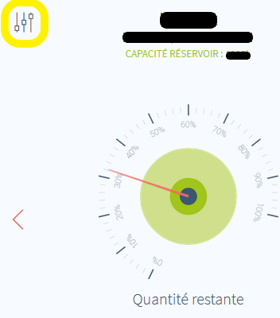
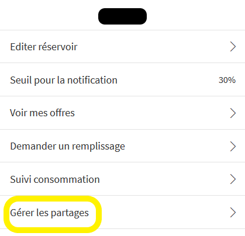

# Description

Plugin getting data from <a href="https://fullup.be/" target="_blank"> Fullup </a>connected gauges. The plugin fetch data every hour via a cron.

# Configuration

## Installation

In order to use the plugin, you must download it, install and activate it like any Jeedom plugin.

> **Tip**
> the plugin uses a "cron hourly" to update the data every hour, you can choose to disable it and update your equipment manually or by other means but it is not necessary to do it more frequently.

## Creating a dedicated user to the plugin in the Fullup application

This step is not mandatory, you can use your current / main Fullup credentials for this plugin but I recommend creating a new user to which you will share access (in read only) to your gauges.

> **Tip**
>
> The plugin only reads the data provided by the gauges (volume, temperature ...).
> No personal data is collected and no changes will be made to the configuration of your gauges / tanks even if you use your main credentials.

- Go to your account at <https://app.fullup.be> or via the mobile app, you must see your already connected gauges.
- Display the gauge you want to view via the plugin in Jeedom then click on the "parameter" menu, highlighted in yellow in the capture:

> **Important**
>
> You will have to share each gauge you have if you want to view it in Jeedom (by reusing the same email address).

- Click the "Manage sharings" menu

- Click on the "+" to add a user

- Enter a new email address (or, if you use a gmail address, a gmail alias by adding +jeedom before @gmail.com for example)

- You will receive a confirmation email to create your new account on the Fullup application, simply follow the procedure.

> **Tip**
>
> Log out of Fullup, open a "private window" on your browser or use another browser to create your second Fullup account otherwise you will be automatically logged in when following the link in the email received.

## Plugin configuration and discovery of gauges

- Go back to the plugin's configuration page and enter your user (email address) and password (from the Fullup account).

- Save the configuration.
- Click on "Search for Fullup Gauges".
- If the credentials are correct, you should see the message "Successful synchronization..."

- In case of error a message will explain the reason for it, for example to check the user and the password

> **Tip**
>
> It is not possible to create devices manually.
> If you want to add new gauges in the future, just go back to this page and click on "Search for Fullup Gauges".
> The plugin will not recreate the existing equipment so there is no risk to perform this synchronization several times.

- There is no additional configuration to perform on the device except to assign the parent object. This one should be already active and have his information updated.

# Changelog

[See the changelog](./changelog)

# Support

If you have a problem, start by reading the latest plugin-related topics on [community]({{site.forum}}/tags/plugin-{{page.pluginId}}).

If despite this you do not find an answer to your question, do not hesitate to create a new topic, with the tag of the plugin ([plugin-{{page.pluginId}}]({{site. forum}}/tags/plugin-{{page.pluginId}})).

At a minimum, you will need to provide:

- a screenshot of the Jeedom health page
- all available plugin logs
- depending on the case, a screenshot of the error encountered, a screenshot of the configuration causing the problem...
