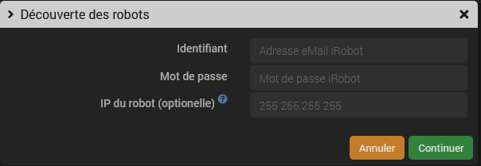

# Description

Plugin permettant de piloter les robots aspirateurs et laveurs de sols de la marque iRobot.

Le plugin a été testé avec succès sur beaucoup de modèles différents et la plupart des modèles wifi de la marque devraient être supportés, si vous avez un doute, testez par vous même et vous serez fixé!
Ce plugin ne fonctionne pas avec les anciens modèles d'aspirateurs robot Roomba munis d'un extension matérielle (type RooWifi ou Thinking Cleaner), il ne fonctionne qu'avec les modèles récents dotés d'une liaison Wifi.

Ce plugin permet la détection et l'appairage automatique des robots Roomba & Braava sur le réseau local, de remonter diverses informations sur l'état du robot (statut, info bac plein, info réservoir...) ainsi que de piloter le robot (Démarrer, Arrêter, Retour à la base...)

Il comporte un Widget desktop.

# Installation

Afin d’utiliser le plugin, vous devez le télécharger, l’installer et l’activer comme tout plugin Jeedom.

Lors de l'installation des dépendances, le plugin *MQTT Manager* a normalement été installé automatiquement s'il ne l'était pas encore. Dans le cas contraire, veuillez installer ce plugin manuellement via le market Jeedom (plugin officiel gratuit)
Ensuite, il faudra éventuellement le configurer (voir documentation du plugin *MQTT Manager*, dans la plupart des cas les options par défaut conviendront parfaitement)

> **Tip**
>
> Si vous avez déjà un broker MQTT installé, il est malgré tout nécessaire d'installer le plugin *MQTT Manager* mais prenez soin de le configurer en mode *broker distant* en renseignant les paramètres de votre broker actuel.

# Configuration du plugin

Dans la page de configuration du plugin, vous pouvez modifier les options suivantes:

- Le topic de base sous lequel le plugin va publier les informations. Par défaut le plugin publiera sous le topic *iRobot*; vous n'avez pas besoin de modifier si cela vous convient
- Le port d'écoute du démon du plugin. Ne modifiez cette valeur que si vous comprenez le fonctionnement et uniquement si vous avez un conflit avec un autre plugin.

Si les dépendances ont bien été installées et que le plugin *MQTT Manager* est démarré et fonctionnel, vous pouvez lancer le démon.

# Découverte et création des équipements (les robots)

Avant de commencer:

- S'assurer que le robot est correctement paramétré sur le réseau local et joignable depuis Jeedom (en principe sur le même réseau local) (procédure via l'application iRobot)
- Couper toute application iRobot sur Android ou iOS. Attention : l'utilisation simultanée de l'application iRobot peut provoquer des blocages de communication entre le plugin et le robot
- S'assurer que le robot est sur sa base et pas "endormi" (appuyer brièvement sur "Clean" pour le réveiller si nécessaire).

Depuis la page de configuration du plugin cliquer sur le bouton *Découverte* et entrez vos identifiants dans la fenêtre qui s’ouvre. Vous pouvez éventuellement renseigner l'adresse IP du robot, c'est utile **et nécessaire** si le robot ne se trouve pas sur le même sous-réseau que Jeedom car le processus de découverte utilise un message broadcast pour trouver les robots.

Ensuite attendez cela prend entre 15s et 30s, vous verrez des notifications à l'écran et le démon redémarrera tout seul à la fin du processus si cela a réussi. L’équipement sera ensuite créé (vous pouvez surveiller l’avancement via le log si nécessaire).

# Liste des états connus et correspondance sur le widget

| Valeur commande *Etat*                             | Signification        |
|----------------------------------------------------|----------------------|
| **Charging** et **Recharging**                     | **En charge**        |
| **Docking - End Mission** et **Mission Completed** | **Tâche achevée**    |
| **Docking** et **User Docking**                    | **Retour à la base** |
| **Paused**                                         | **Mis en pause**     |
| **Running**                                        | **Nettoyage**        |
| **Stopped**                                        | **Arrêté**           |
| **Stuck** et **Base Unplugged**                    | **Bloqué**           |

> **Tip**
>
> Lorsque la procédure de découverte est terminée, vous pouvez à nouveau utiliser votre application mobile iRobot si nécessaire.

# Historique

Ce plugin a été initialement créé par @kavod (Brice Grichy).
Le plugin a ensuite été repris par @vedrine

# Changelog

[Voir le changelog](./changelog)

# Support

Si malgré cette documentation et après voir lu les sujets en rapport avec le plugin sur [community]({{site.forum}}/tags/plugin-{{page.pluginId}}) vous ne trouvez pas de réponse à votre question, n'hésitez pas à créer un nouveau sujet en n'oubliant pas de mettre le tag du plugin ([plugin-{{page.pluginId}}]({{site.forum}}/tags/plugin-{{page.pluginId}})).
