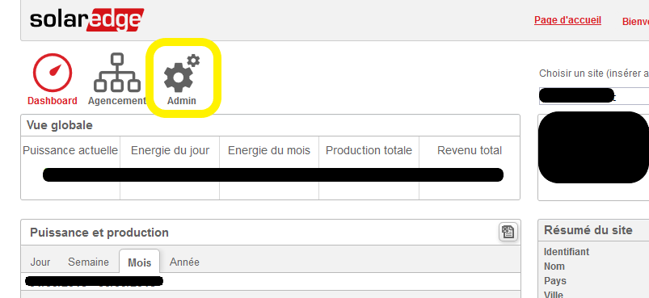

# Description

Plugin permettant la lecture des données d'un onduleur de panneaux photovoltaïque de la marque Solaredge. Le plugin rafraîchit les données toutes les 5 minutes via un cron.
Le plugin utilise l'API mise à disposition par Solaredge pour récupérer les données se trouvant dans la plateforme de monitoring.
Les informations suivantes sont récupérables, d'autres pourraient être rajoutée selon les demandes:

- Aperçu global (puissance actuelle et historique de production)
- Puissance actuelle des différents équipements dans l'installation & flux entre ceux-ci (si supporté par votre installation)
- Détails des consommations d'énergie du dernier quart d'heure (achat, production, consommation, auto-consommation)
- Détails de puissance du dernier quart d'heure (achat, production, consommation, auto-consommation)

# Configuration

## Installation

> **Tip**
>
> Afin d’utiliser le plugin, vous devez le télécharger, l’installer et l’activer comme tout plugin Jeedom.

Le plugin utilise le "cron5" pour récupérer les données toutes les 5 minutes. Vous pouvez choisir de le désactiver et d'actualiser vos équipements manuellement ou via un autre moyen mais il n'est pas nécessaire de le faire plus fréquemment.
> **Important**
>
> Solaredge n'autorise que 300 appels par jours via l'API; actualiser les données toutes les 5 minutes pendant 24 heures exécutera 288 appels (donc en dessous de la limite des 300). Si vous choisissez de gérer l'actualisation des données autrement, prenez soin de ne pas dépasser cette limite.

- Sur la page de configuration du plugin, il est possible de renseigner un équipement/commande pour l'heure du lever et l'heure du coucher du soleil tel que fournit par le plugin "Météo" ou "Héliotrope". Ceci permettra de "mettre en pause" la récupération des données entre ces heures car il y a généralement peu de production solaire la nuit ;-). Si aucune commande n'est fournie, la tâche sera "en pause" entre 22h00 et 04h00 (non configurable pour l'instant).

## Activation de l'accès API Solaredge

- Rendez-vous sur votre compte à l'adresse <https://monitoring.solaredge.com/> (vous devez vous connecter avec les identifiants reçu de votre fournisseur), vous devriez arriver sur votre Dashboard.
- Ensuite, cliquez sur la section "Admin", en jaune dans la capture:

- Ensuite, cliquez sur l'onglet "Politique d'accès..." et dans le bas de l'écran vous devez accepter les conditions d'utilisations, générer une nouvelle clé (ou copier celle existante) et prendre note de l'ID du site. N'oubliez pas de sauver les changements.

## Création de l'équipement dans votre Jeedom

- Rendez-vous sur la page de configuration des équipements via le menu "Plugins", puis "Energie" et "{{site.title}}".
- Cliquez sur "Ajouter" et donnez un nom.
- Vous arriverez sur la page de configuration de l'équipement sur laquelle vous pouvez configurer les options habituelles dans Jeedom (n'oubliez pas d'activer votre nouvel équipement).

> **Important**
>
> Vous devez renseigner la clé API et l'ID du site précédemment générés/copiés depuis la plateforme de monitoring de Solaredge.

Choisissez ensuite le type d'informations voulue. Si vous en voulez plus qu'une il suffit de créer un deuxième équipement avec le même ID de site et la même clé API.

- C'est tout, vous pouvez retourner sur votre dashboard pour voir le widget correspondant.

Aperçu global:

Puissance actuelle des différents équipements avec information de production/consommation/auto-consommation, achat/vente et chargement/déchargement batterie (selon les équipements de votre installation).

Exemple achat:

Exemple vente:

Soit vous attendez 5 min. que la tâche cron s'éxécute pour voir les données soit vous faite une première actualisation manuellement.

# Changelog

[Voir le changelog]({{site.baseurl}}/changelog)

# Support

Si malgré cette documentation et après voir lu les sujets en rapport avec le plugin sur [community]({{site.forum}}/tags/plugin-{{page.pluginId}}) vous ne trouvez pas de réponse à votre question, n'hésitez pas à créer un nouveau sujet en n'oubliant pas de mettre le tag du plugin ([plugin-{{page.pluginId}}]({{site.forum}}/tags/plugin-{{page.pluginId}})).
