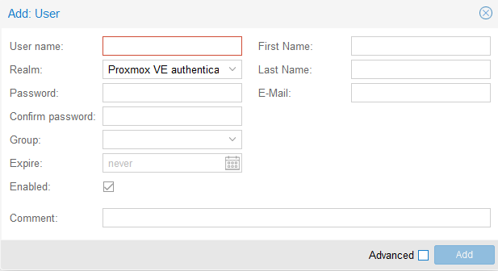
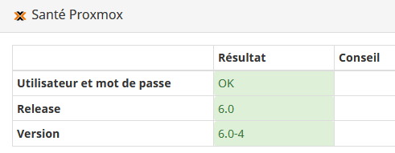

# Description

Plugin allowing the management of a Proxmox server. It is possible to get all resources (nodes, vm, lxc, storage) and all their properties (status, memory, CPU, disk, IP address, up time, snapshots list...). The plugin can also start, stop vm and containers and take snapshots.
It also has a specific health page summarizing all the information on your devices.
Le plugin permet aussi de démarrer et arrêter les VMs et les containers ainsi que de prendre des snapshots et des backups.
Il dispose également d'une page santé spécifique résumant l'ensemble des informations de vos équipements.

# Installation

In order to use the plugin, you must download, install and activate it like any Jeedom plugin.

# Proxmox User Configuration

> **Tip**
>
> It is recommended to create a local user dedicated to Jeedom and that is what is documented here, other configurations are possible of course as long as Jeedom has a user having access to Proxmox resources that you want to monitor.

Creating a Proxmox user will not be documented in detail here, just the main information, please use the official Proxmox documentation for more details.

This configuration is done on the "datacenter" in the Proxmox interface, menu "Permissions"

## User creation

In the Permissions>Users menu, click on "Add" and complete the following screen:

> **Important**
>
> Select the realm "Proxmox VE authentication server" otherwise you will not be able to choose the password here.

Remember the username and password chosen, this will be configured in the plugin.

## Assigning permissions

We have created a new user under Proxmox but this one has no access yet.

In the main menu "Permissions", click on "Add" then "User permission" and fill in the following screen according to the permissions you want to grant to Jeedom (see the Proxmox documentation for more details):

> **Tip**
>
> The configuration below gives full administration rights to the user jeedom@pve on all Proxmox resources.

# Plugin configuration

The following information must be entered in the plugin configuration:

- IP address of your server (or one of them if you have multiple nodes)
- the port if different from the default port (8006)
- a username and password
- the authentication realm of the user, if different from "pve" (= "Proxmox VE authentication server", default realm for users created locally on Proxmox, see Proxmox documentation)

You can check if the configuration of the plugin is correct thanks to the health page (menu Analysis > Health)

If the connection is successful, the version of your Proxmox server will be displayed.

# How the plugin works

Once a user is set up, the plugin will try to connect to Proxmox every minute to synchronize.

All resources to which the plugin has access will be automatically created in Jeedom, it is not possible to manually create a device.

It is possible to do a manual synchronization via the button in the device page.

# Available commands

## The nodes

These devices have several info commands giving the up time, CPU, disk and memory usage as well as information on the number and type of CPU and the version of the kernel used.
The following action commands are also available:

- **Reboot the node**: Stop all the VMs and reboot the node
- **Shutdown the node**: Shutdown all VMS and the node
- **Start all**: Starts all machines and containers that have the "Start at boot" option activated
- **Shutdown all**: Shutdown all virtual machines and containers

## Virtual machines & containers

Plusieurs commandes info existent donnant entre autre le statut, le nombre de CPU et leur utilisation, la mémoire totale et l'utilisation, le temps d'activité, les adresses IPv4 et IPv6.

> **Tip**
>
> Pour remonter les adresses IP, il est nécessaire d'installer l'agent Proxmox sur les VMs et de l'activer (voir documentation Proxmox). Cet agent assurera aussi un état stable de votre VM lors des sauvegardes et snapshots.

Les commandes actions suivantes sont également disponibles:

- **Start**: Starts the virtual machine or container.
- **Shutdown**: This triggers a clean shutdown of the virtual machine or container.
- **Stop immediately**: This immediately and abruptly stops the virtual machine or container, this can damage the data.
- **Suspend**: Suspends the virtual machine or the container
- **Resume**: Resume the virtual machine or the container after being suspended
- **Snapshot**: allows to take a snapshot, it is possible to give the name of the snapshot (optional). The name must consist exclusively of letter and number as well as the underscore character (_) and must begin with a letter. If no name is provided or the name is not valid, a random name will be generated by the plugin.
- **Backup**: allows to take a backup. This command (of type message) has an 'email' field which can contain an email address to which a notification will be sent once the backup is finished (email sent by your Proxmox server) and an 'Options' field in which you can pass each desired option in the form option = value; see the table below for a list of available options.

Name | Description | Format | Default value
- | - | - | -
storage | Backup location | The name of the storage resource that must be configured as destination for 'backup' content and be 'available'. Be careful to respect the case. | By default, the first storage meeting the criteria is used.
mode | Backup mode | the possible values are: `snapshot|suspend|stop` | `snapshot`
compress | Backup compression | the possible values are: `0|gzip|lzo` | `lzo`
mailnotification | Specifies when to send a notification | the possible values are: `always|failure` | `always`
remove | Deletes old backups if there are more than the maximum configured for the chosen storage (see Proxmox configuration)| the possible values are: `0|1` | `1`

## The storages

Info commands give the disk usage as well as the status of the device.

It is also possible to see the type of content (backup, iso, disks of vms ...); this information is useful when using the "Backup" command of virtual machines.

# Changelog

[See the changelog](./changelog)

# Support

If despite this documentation and after having read the topics related to the plugin on [community]({{site.forum}}/tags/plugin-{{page.pluginId}}) you do not find an answer to your question, do not hesitate to create a new topic with the tag of the plugin ([plugin-{{page.pluginId}}]({{site.forum}}/tags/plugin-{{page.pluginId}})).
