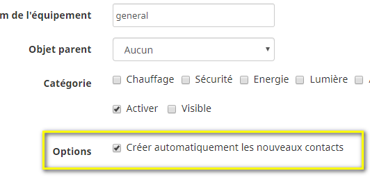

# Description

Plugin permettant la connexion à un serveur Rocket.chat. Rocket.chat est un plateforme de messagerie collaborative (type Slack, HipChat...).
Le plugin gère le ask (dans les scénarios), les interactions et l'envoi de pièces jointes (ex: image de caméra).
L'avantage de cette solution est de pouvoir être hébergée chez vous (un docker suffit), vos données reste ainsi en votre possession.

# Installation

Afin d’utiliser le plugin, vous devez le télécharger, l’installer et l’activer comme tout plugin Jeedom.
Il est nécessaire de déjà avoir un serveur Rocket.chat, les différentes solutions pour cela sont très bien documentée sur leur site.
Sur celui-ci, veillez à créer un utilisateur ayant comme role `bot`.

> **Important**
>
> Le plugin a été testé sous debian et raspbian version 9 (stretch) et 10 (buster).
> Le plugin n'a pas été testé sous Jessie et son fonctionnement sur cette version ne sera pas assuré.

Sous Debian Stretch, l'installation des dépendances peut prendre 20min ou plus en fonction de votre matériel.
Sous Debian Buster, cela devrait être beaucoup plus rapide étant donné que la majorité est déjà présente.

# Configuration du plugin

Dans la configuration du plugin il faudra renseigner l'URL du server rocketchat sous la forme `https://yourdomain.com:3000` ainsi que le nom d'utilisateur et le mot de passe de votre bot.

# Les équipements

Dès que le démon démarre et que votre bot a pu se connecter, le plugin va créer un équipement par canal existant sur votre server (pour autant que le bot ait accès).

Chaque équipement dispose d'une commande action pour envoyer un message sur le canal ainsi que deux commandes info donnant le dernier message envoyé (par un autre utilisateur que le bot) et le nom de l'utilisateur.

Par défaut, lorsqu'un message est reçu sur le canal, le plugin va créer un commande correspondante à l'utilisateur l'ayant envoyé (si elle n'existe pas déjà).

Une option existe sur l'équipement pour désactiver ce comportement.

Ces commandes permettent d'envoyer un message sur le canal de l'équipement mais en notifiant l'utilisateur correspondant, (ex: `@Mips Ceci est un message test`).

# Interactions

Pour que les interactions fonctionnent, il faut que le plugin connaissent l'utilisateur, il faut donc que la commande correspondante ait été créé (voir ci-dessus).

Ensuite, dans l'onglet commande, il faut sélectionner l'utilisateur Jeedom correspondant à l'utilisateur Rocket.Chat en le sélectionnant dans la liste. Il est possible d'activer ou désactiver la prise en charges des interactions pour chaque utilisateur.
.

Dans les canaux publics ou les groupes de discussions privés, votre bot (le plugin) ne répondra aux interactions que s'il est notifié sur le canal (ex: `@jeedombot Allume la radio`) ceci afin d'éviter qu'il ne réponde `Désolé je n'ai pas compris` à chaque message échangé entre d'autres utilisateurs.
Ceci n'est pas le cas dans les messages directes privés entre vous et le bot.

# Changelog

[Voir le changelog](./changelog)

# Support

Si malgré cette documentation et après voir lu les sujets en rapport avec le plugin sur [community]({{site.forum}}/tags/plugin-{{page.pluginId}}) vous ne trouvez pas de réponse à votre question, n'hésitez pas à créer un nouveau sujet en n'oubliant pas de mettre le tag du plugin ([plugin-{{page.pluginId}}]({{site.forum}}/tags/plugin-{{page.pluginId}})).
