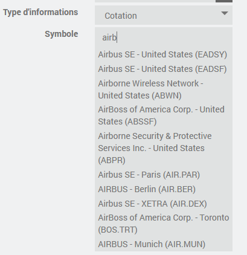
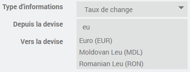

# Description

Plugin permettant de récupérer les cours de bourse d'une action ou d'un indice mais également le taux de change entre deux devises (y compris crypto-monnaie comme le bitcoin) ainsi que les matières premières.
Toutes les données sont généralement disponibles en temps réel mais la fréquence d'actualisation dépend du service utilisé.

# Installation

Afin d’utiliser le plugin, vous devez le télécharger, l’installer et l’activer comme tout plugin Jeedom.

# Configuration du plugin

Il n'y a aucune configuration à effectuer au niveau du plugin, les clés API se configure sur les équipements en fonction du service sélectionné.

# Configuration d'un équipement

Après avoir créé un nouvel équipement, les options habituelles sont disponibles.
Vous pourrez également renseigner la fréquence d'actualisation des informations.

Ensuite vous devez sélectionner le service à utiliser pour cet équipement parmi la liste proposé. Une description de chaque service est disponible dans la page de configuration. Vous y trouverez également le lien pour créer un nouveau compte si vous n'en avez pas encore ou si vous désirez en créer un nouveau.

Il faudra ensuite renseigner la clé API correspondante au service.

> **Tip**
> Faite attention à ne pas demander une actualisation trop fréquente si cela n'est pas nécessaire en tenant compte du nombre d'équipement que vous créez afin de ne pas dépasser la limite imposée par le service.

Vous devez ensuite choisir le type d'informations souhaitée:

- Cotation boursière: le cours d'une action ou d'un indice (selon le service sélectionné)
- Taux de change entre 2 devises (y compris crypto-monnaie)

## Cotation boursière & indice boursier

Pour ce type d'information, vous devez renseigner le symbole de l'action ou de l'indice.
Le plugin offre une fonction de recherche dynamique, commencez simplement à taper le nom d'une entreprise (minimum 3 caractères) ou le symbole voulu et une liste de possibilités sera proposée. Vous n'avez plus qu'à choisir parmi celles-ci.

## Taux de change

Pour ce type d'information, vous devez choisir la devise d'origine et de destination.
Le plugin offre une fonction de recherche dynamique, commencez simplement à taper le nom d'une devise ou son code et une liste des devise correspondante sera proposée. Vous n'avez plus qu'à choisir parmi celles-ci.

## Matière première

Pour ce type d'information, vous devez renseigner le symbole de la matière première.
Le plugin offre une fonction de recherche dynamique, commencez simplement à taper le nom d'une matière première (minimum 3 caractères) ou le symbole voulu et une liste de possibilités sera proposée. Vous n'avez plus qu'à choisir parmi celles-ci.

# Les commandes disponibles

Vous trouverez ci-dessous un aperçu des commandes les plus importantes disponibles par type d'information.

## Cotation boursière

- **Ouverture**: prix à l'ouverture
- **Fermeture précédente**: prix à la fermeture précédente
- **Max**: maximum atteint depuis l'ouverture
- **Min**: minimum atteint depuis l'ouverture
- **Prix**: prix actuel
- **Volume**: Volume d'action
- **Evolution**: Evolution depuis l'ouverture

## Taux de change

- **Taux de change**
- **Offre**: le prix de l'offre
- **Demande**: le prix de la demande

## Matière première

- **Prix**
- **Devise**
- **Unité**
- **Date**

# Changelog

[Voir le changelog](./changelog)

# Support

Si vous avez un problème, commencez par lire les derniers sujets en rapport avec le plugin sur [community]({{site.forum}}/tags/plugin-{{page.pluginId}}).

Si malgré tout vous ne trouvez pas de réponse à votre question, n'hésitez pas à créer un nouveau sujet en n'oubliant pas de mettre le tag du plugin ([plugin-{{page.pluginId}}]({{site.forum}}/tags/plugin-{{page.pluginId}})).

Il faudra au minimum fournir:

- une capture d'écran de la page santé Jeedom
- tous les logs disponibles du plugin
- selon les cas, une capture d'écran de l'erreur rencontrée, une capture d'écran de la configuration posant problème...
